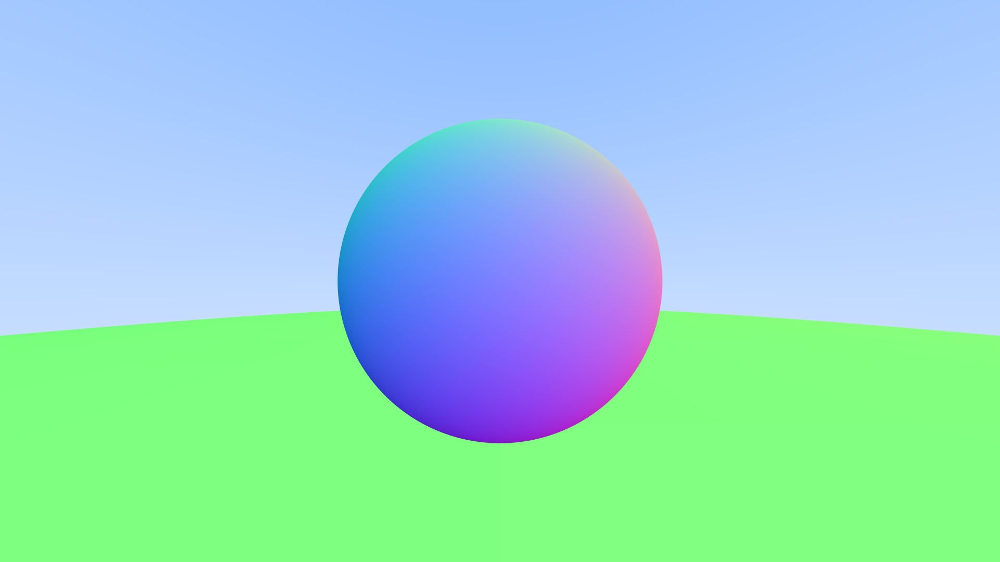

# rayforge
## A multithreaded, zero-dependency ray tracer written in pure Rust.

Inspired by Ray Tracing in One Weekend. Currently renders spheres with anti-aliasing, multi-threading, and a simple config file. Outputs PPM.

Features

- Zero external dependencies — only the standard library + workspace crates
- Multithreaded rendering with dynamic work stealing (row chunks)
- Configurable via config.env (resolution, samples, threads, FOV, …)
- Anti-aliasing via multi-sample jittered sampling
- Builder pattern for the camera (CameraBuilder)


Strict Clippy lints (pedantic + nursery + no unwrap/panic/indexing)

Project Layout

```text
.
├── Cargo.toml                 # workspace root
├── config.env                 # render settings
├── crates/
│   ├── rayforge/              # binary crate
│   ├── rayforge_core/         # core library (math, shapes, camera, …)
│   └── rander/                # tiny RNG
├── README.md
└── ROADMAP.md
```

### Quick Start
#### clone & build
```terminal
cargo build --release
```
#### render with defaults from config.env

```terminal
cargo run --release -p rayforge
```

### output lands in render.ppm (or whatever you set in config.env)

View the result with any image viewer that supports PPM, or convert it:

Configuration (config.env)

``` text
output_name=render.ppm
image_width_pixels=1920
image_height_pixels=1080
viewport_height=2.0
focal_length=1.0
samples_per_pixel=100
vfov=90.0
max_depth=50
// num_threads=8
// optional — defaults to available parallelism
```

Missing keys fall back to sensible defaults. The whole file can be absent and the renderer still runs.

### Current Scene



A small sphere floating above a giant ground sphere (classic “two spheres” test). Easy to extend. just push more `Shapes::Sphere` into the `HittableList` in `main.rs`.
